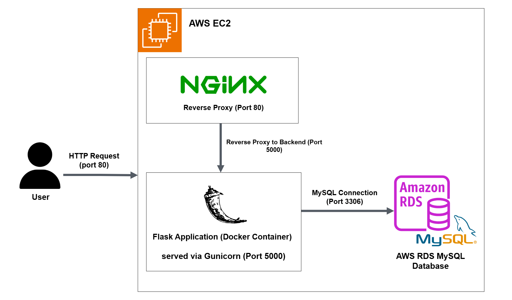
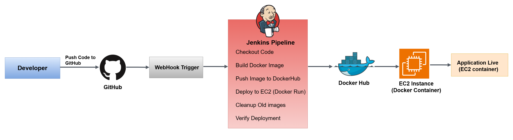

# Two-Tier flask Application deployment on AWS

This project demonstrates the end-to-end deployment of two-tier web application using Flask and MySQL on AWS. The application is containerized using Docker and deployed on an EC2 instance, with Nginx configured as a reverse proxy to handle incoming traffic. A fully automated CI/CD pipeline is implemented using Jenkins, which builds Docker images, pushes them to Docker Hub, and deploys updated containers on the server whenever changes are pushed to the GitHub repository. The backend application connects to an AWS RDS MySQL database for persistent data storage, ensuring scalability and reliability.

## System Architecture

## Runtime-Architecture

## CI/CD Pipeline Architecture

## Tech Stack

Technologies used to build, deploy, and automate the application:

### Application
- Flask (Python)

### Database
- MySQL (AWS RDS)

### Containerization
- Docker

### Web Server
- Nginx
- Gunicorn

### CI/CD
- Jenkins
- Docker Hub (image registry)

### Cloud & Infrastructure
- AWS EC2

### Version Control
- GitHub

### Networking & Security
- Security Groups
- SSH

### Monitoring
- AWS CloudWatch

# System Overview

- Application is containerized using Docker
- Nginx acts as a reverse proxy to route traffic to the Flask app
- Jenkins automates build and deployment using CI/CD pipeline
- Docker images are stored in Docker Hub
- Application is deployed on AWS EC2 and connects to AWS RDS

# CI/CD Workflow

1. Developer pushes code to GitHub repository  
2. GitHub triggers Jenkins pipeline using webhook  
3. Jenkins pulls the latest code from the repository  
4. Docker image is built for the Flask application  
5. Image is pushed to Docker Hub  
6. EC2 instance pulls the latest Docker image  
7. Docker container is deployed/updated on EC2  
8. Application becomes live and accessible to users

## Live Demo

http://54.226.198.123/
